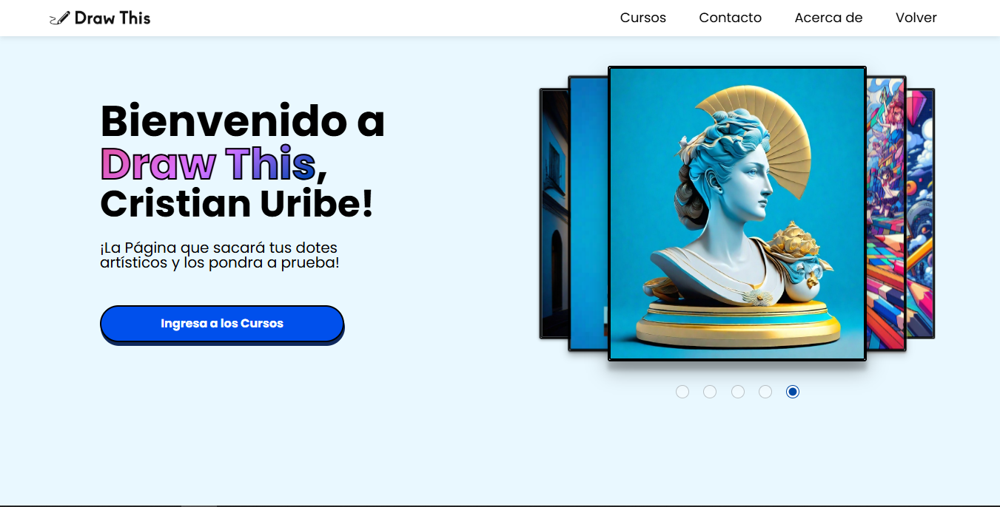

## 🚀 Sobre Mi

  Estudiante de la carrera de Desarrollo de Software e Ingeniería de Sistemas del 

 
  
  Graduado como Técnico Laboral Auxiliar en Desarrollo de Software de la

## 🏆 Proyectos Destacados

Draw This

## 🛠️ My Toolkit / Mis Herramientas

**Languages/Lenguajes:**

  
  

**Frameworks/Marcos de Trabajo:**

  

**Deployment/Despliegues:**

  

