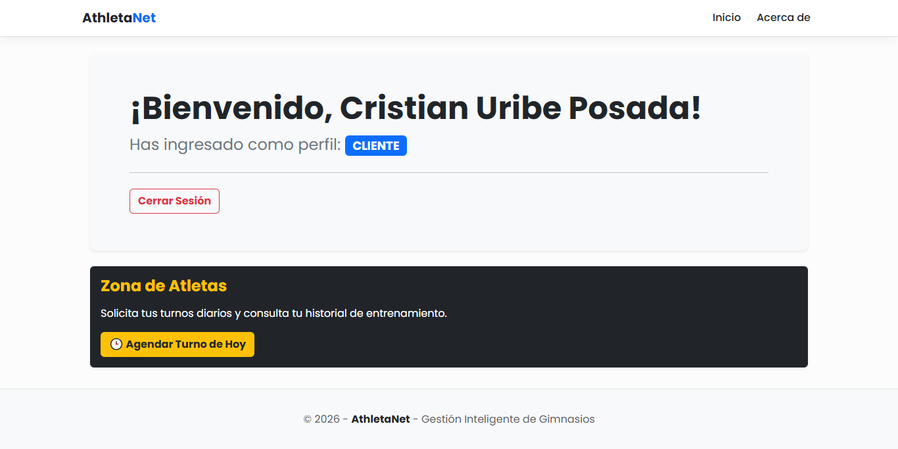
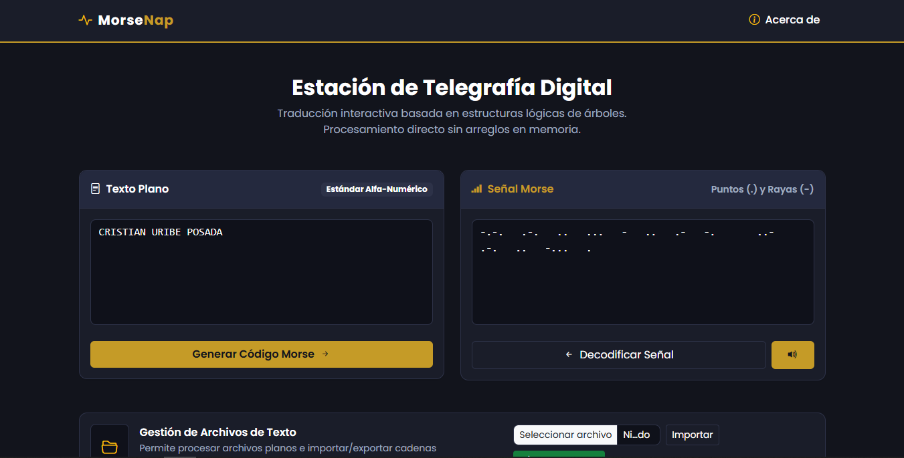

## 🚀 Sobre Mi

  Estudiante de la carrera de Desarrollo de Software e Ingeniería de Sistemas del 

 
  
  Graduado como Técnico Laboral Auxiliar en Desarrollo de Software de la

## 🏆 Proyectos Destacados

<h3>Draw This</h3>

 
<a href="https://drawthis.vercel.app/">https://drawthis.vercel.app/</a>

<h3>AthletaNet</h3>

 
<a href="https://athletanet.up.railway.app/">https://athletanet.up.railway.app/</a>

<h3>MorseNap</h3>

 
<a href="https://morsenap.up.railway.app/">https://morsenap.up.railway.app/</a>

## 🛠️ My Toolkit / Mis Herramientas

**Languages/Lenguajes:**

  
  
  
  
  
  

**Frameworks/Marcos de Trabajo:**

  
  

**Deployment/Despliegues:**

  
  

